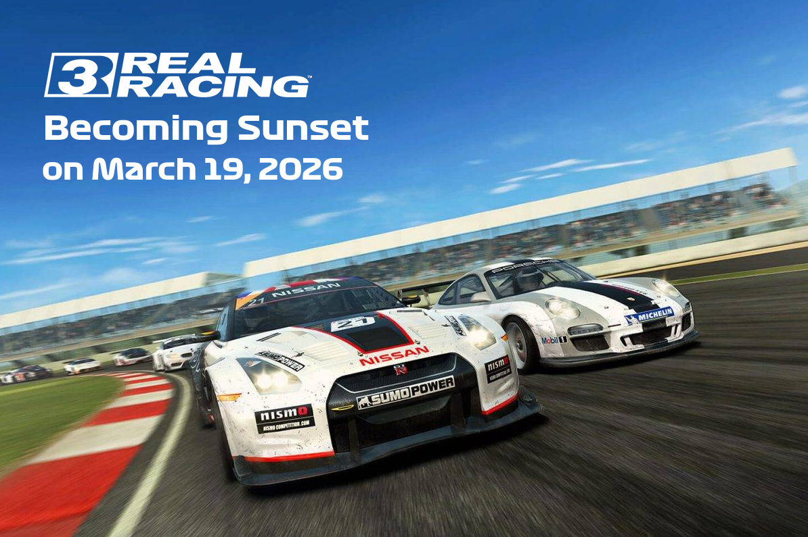

# Real Racing 3 Cars

**Datasets & Analyses for All Cars in Real Racing 3**

Hello everyone! I've been playing this mobile racing game, **Real Racing 3** (developed by **Firemonkey**, then **Slingshot** and published by **Electronic Arts**) for at least 8-9 years. As the game is almost 13 years old, it contains over 500 cars to drive around various tracks (e.g., Silverstone, Laguna Seca, Dubai Autodrome, Red Bull Ring, etc.).

As a Data Scientist role, here I've created the datasets that list all the cars appeared in the game for each version; also including those that no longer available for purchase. 

I started this repository project from **game version 8.0**. Here, you can find car datasets for the most recent version and those from the previous versions in **PreviousDatasets** folder.

## THE FINAL LAP

## Cars Dataset Version Info

**Latest Dataset Version:** 4.0.0

**Last Updated:** 27th December 2025

**Car Roster Dependency:** Game Version 14.0 - Untitled Final Update

## Cars Dataset Features

All the values in the cars dataset, including for the previous versions were obtained from the game's [wiki website](https://rr3.fandom.com/wiki/Main_Page). However, while retrieving the necessary data, some of them might've been inconsistent or obsolete. For this reason, I carefully filled with the most accurate values by double-checking everything and gave the final shape, being the fullest and the most informative one for **version 14.0**.

**The latest dataset contains these features below for each car:**
* `Manufacturer` : The manufacturer name (or motorsport discipline)
* `Model` : The model name of the manufacturer
* `PR` : Base Performance Rating value (no upgrades)
* `Top Speed` : Base top speed value (in kph)
* `Acceleration` : Base acceleration value (in seconds)
* `Braking` : Base braking value (in meters)
* `Grip` : Base cornering grip value (in g)
* `Class` : Indicates the car class (`P`, `S` or `R`)
* `Type` : Indicates the car type w.r.t. engine placement and traction (e.g. `FR`, `M4`, `RR`) 
* `Series` : Describes the number of eligible career series the car can be driven
* `Price` : The value for purchasing the car with the related currrency type (`R$`, `Gold` or `M$`)
* `Service Time` : Required total servicing time (in minutes)
* `Service Cost` : Required servicing cost (in R$)
* `Is Available` : Indicates whether or not the car is available for purchase in the game
* `Has Exclusive Events` : Indicates whether or not the car has its own exclusive events to access when fully upgraded
* `In Motorsports`: Indicates whether or not the car is involved in Motorsports series
* `In Road Collection`: Indicates whether or not the car is involved in Road Collection series
* `In Main Career`: Indicates whether or not the car is involved in Main Career series
* `In Season 1/2/3/4/5` : Indicates whether or not the car is involved in special events, limited-time series or bonus career series in all rounds of Season 1, 2, 3, 4, and 5 respectively

## Additional Dataset

In the meantime, an additional dataset can be seen in the repo, containing all the series across all different disciplines and tiers from **Motorsports** and **Road Collection** (including special career series and exclusive series) for the latest version of Real Racing 3. 

Each row represents the main tab, name of the group, name of the series and individual car with the manufacturer-model name belonging to that series. So, please make sure taking a look at the new dataset to observe the eligibility of any car you enjoy driving!

## My Data Analyses

As Real Racing 3 no longer gets new updates, there will be one last data analyses on the cars of the final version (v14.0) to work on. It might take some time to publish here, so stay tuned.

**Currently, the latest performed analyses are presented here (formatted in Jupyter Notebook), based on game version 12.6.**

| Parts | Features |
| ----- | -------- |
| [Part 1](https://github.com/toUpperCase78/real-racing-3-vehicles/blob/master/RR3_Analysis1_Rev5.ipynb) | Basic & Intermediate Data Analyses |
| [Part 2](https://github.com/toUpperCase78/real-racing-3-vehicles/blob/master/RR3_Analysis2_Rev4.ipynb) | Advanced Data Analyses |
| [Part 3](https://github.com/toUpperCase78/real-racing-3-vehicles/blob/master/RR3_Analysis3_Rev4.ipynb) | Several Data Visualizations |

## My Car Wishlist

If the developers continued delivering updates on a regular basis, these were the cars on my wishlist; to be purchasable and driveable in Real Racing 3 (as some of them have already been carried out):

- [ ] Abarth 124 Spider
- [ ] Abarth 500
- [ ] Alfa Romeo Giulia GTAm
- [ ] Alpine A110 (2017)
- [ ] Aston Martin DB5
- [ ] Aston Martin DB11
- [ ] Aston Martin DB12
- [ ] Aston Martin Superleggera DBS
- [ ] Aston Martin Vantage (2024)
- [ ] Aston Martin Valkyrie AMR Pro
- [X] ~~Aston Martin Valour~~
- [ ] Aston Martin Zagato
- [ ] Audi Quattro S1 Rally
- [X] ~~Audi R8 (New Gen.)~~
- [ ] BMW i8
- [X] ~~BMW M3 GTR~~
- [X] ~~BMW M4 Coupe~~
- [X] ~~Bugatti Centodieci~~
- [ ] Bugatti Tourbillon
- [ ] Dallara Stradale
- [ ] Ferrari 12Cilindri
- [ ] Ferrari 296 GT3
- [X] ~~Ferrari 296 GTB~~
- [X] ~~Ferrari 499P~~
- [ ] Ferrari 812 GTS
- [ ] Ferrari 849 Testarossa
- [ ] Ferrari F2004
- [ ] Ferrari F80
- [X] ~~Ferrari Monza SP1~~
- [ ] Ferrari Roma
- [X] ~~Ford Focus RS~~
- [ ] Ford Sierra RS Cosworth
- [X] ~~Ferrari SF90 Stradale~~
- [X] ~~Formula 1 2022 Season~~
- [X] ~~Formula 1 2023 Season~~
- [X] ~~Formula 1 2024 Season~~
- [ ] Formula 1 2025 Season
- [ ] Formula 1 2025 Season Safety Cars
- [X] ~~Honda Civic Type-R (Latest Gen)~~
- [ ] Hyundai Ioniq 5 N
- [X] ~~Koenigsegg CC850~~
- [X] ~~Koenigsegg Gemera~~
- [X] ~~Koenigsegg Jesko~~
- [ ] Lamborghini Aventador J
- [ ] Lamborghini Egoista
- [ ] Lamborghini Revuelto
- [ ] Lamborghini Temerario
- [ ] Lancia Delta HT Integrale
- [ ] Lotus Elise
- [ ] Lotus Evora
- [ ] Maserati MC12
- [ ] Maserati MC20
- [X] ~~Mazda MX-5 (ND)~~
- [ ] Mazda RX-8
- [X] ~~McLaren Artura~~
- [ ] McLaren Elva
- [ ] McLaren MP4-13
- [X] ~~McLaren Solus GT~~
- [X] ~~McLaren Speedtail~~
- [ ] McLaren W1
- [ ] Mercedes-AMG ONE
- [ ] Mini John Cooper Works
- [ ] Mitsubishi Lancer Evolution IX
- [X] ~~Mitsubishi Lancer Evolution X~~
- [X] ~~Nissan Z~~
- [X] ~~Peugeot 9X8~~
- [X] ~~Porsche 911 Carrera (992)~~
- [ ] Porsche 911 GT3 Cup (992)
- [ ] Porsche Mission X
- [ ] Renault R26
- [X] ~~Rimac Nevera~~
- [ ] Saleen S7
- [ ] Subaru BRZ
- [ ] Subaru Impreza WRX STI (2nd-5th Gen.)
- [ ] Toyota GR86
- [ ] Toyota Supra (Latest Gen)
- [ ] W Motors Lykan Hypersport

## KEEP RACING UNTIL THE LAST DAY!
